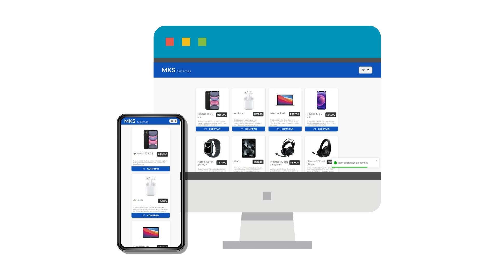

# MKS FrontEnd Challenge

</img>

Este projeto foi desenvolvido como parte do desafio de frontend da MKS, utilizando Next.js, Axios, Stitches, Skeleton, TypeScript e LocalStorage. O projeto consiste em um e-commerce que consome uma API da MKS para exibir produtos e oferece funcionalidades interativas de carrinho de compras.

## Instalação

Certifique-se de ter o Node.js instalado. Clone o repositório e execute o seguinte comando:

```bash
npm install
```

# Execução do Projeto

Para rodar o projeto localmente, utilize o comando:

```bash
npm run dev
```

Isso iniciará o servidor de desenvolvimento em http://localhost:3000.

# Funcionalidades
- Listagem de Produtos: Os produtos são obtidos da API da MKS e exibidos na página inicial.
- Adição ao Carrinho: É possível adicionar produtos ao carrinho, com a opção de aumentar a quantidade caso o produto já esteja no carrinho.
- Remoção do Carrinho: Produtos podem ser removidos individualmente do carrinho.
- Finalização da Compra: A finalização da compra é possível quando há itens no carrinho. Ao finalizar, o carrinho é esvaziado.